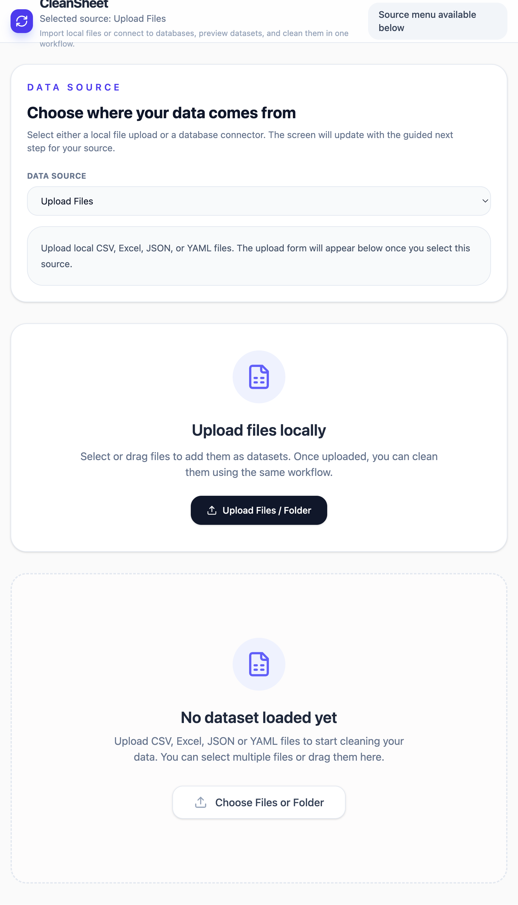
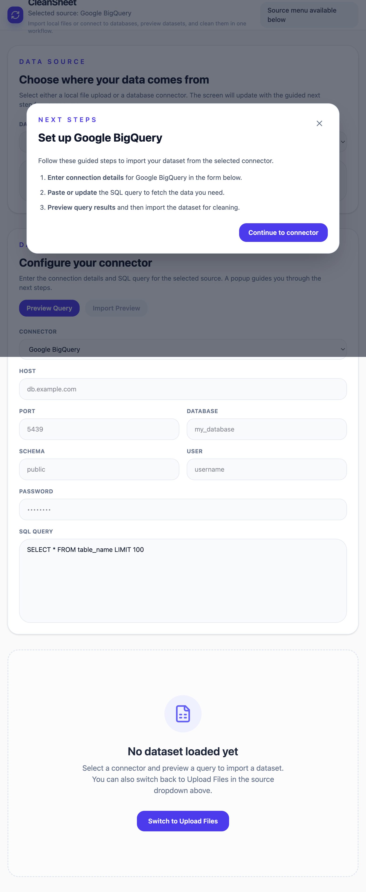

# CleanPro User Guide

## Overview
CleanPro is a modern data cleaning tool for React and Vite users. It lets you:

- Upload local datasets in CSV, Excel, JSON, or YAML format
- Connect to database sources such as AWS Redshift, Azure Synapse, Snowflake, Google BigQuery, PostgreSQL, MySQL, SQL Server, Oracle, MongoDB, and Databricks
- Preview query results before importing data for cleaning
- Apply configurable cleanup rules for nulls, blanks, zeros, and duplicates
- Download cleaned CSV output

## What the App Does

CleanPro guides users through a simple data preparation workflow:

1. Select a data source: local file upload or database connector
2. Preview the dataset in the app
3. Configure cleaning rules for nulls, blank strings, zero values, and duplicates
4. Apply cleaning and review the output
5. Download the cleaned dataset as CSV

## Screenshots

### Before

### After

## How to Use

1. Start the app with `npm run dev`
2. Open `http://localhost:3000`
3. Choose `Upload Files` to load local CSV, Excel, JSON, or YAML files
4. Or choose a connector like `Google BigQuery` to configure database import
5. Use the cleaning rules panel to choose how to handle:
   - Null values
   - Blank strings
   - Zero values
   - Duplicates
6. Click the clean action, then download the cleaned CSV

## Notes

- The app supports multiple input formats and connector preview workflows.
- The guide images show the initial source selection screen and the connector setup flow.
- `docs/CleanPro-User-Guide.pdf` contains the same guide with embedded images for easy sharing.
